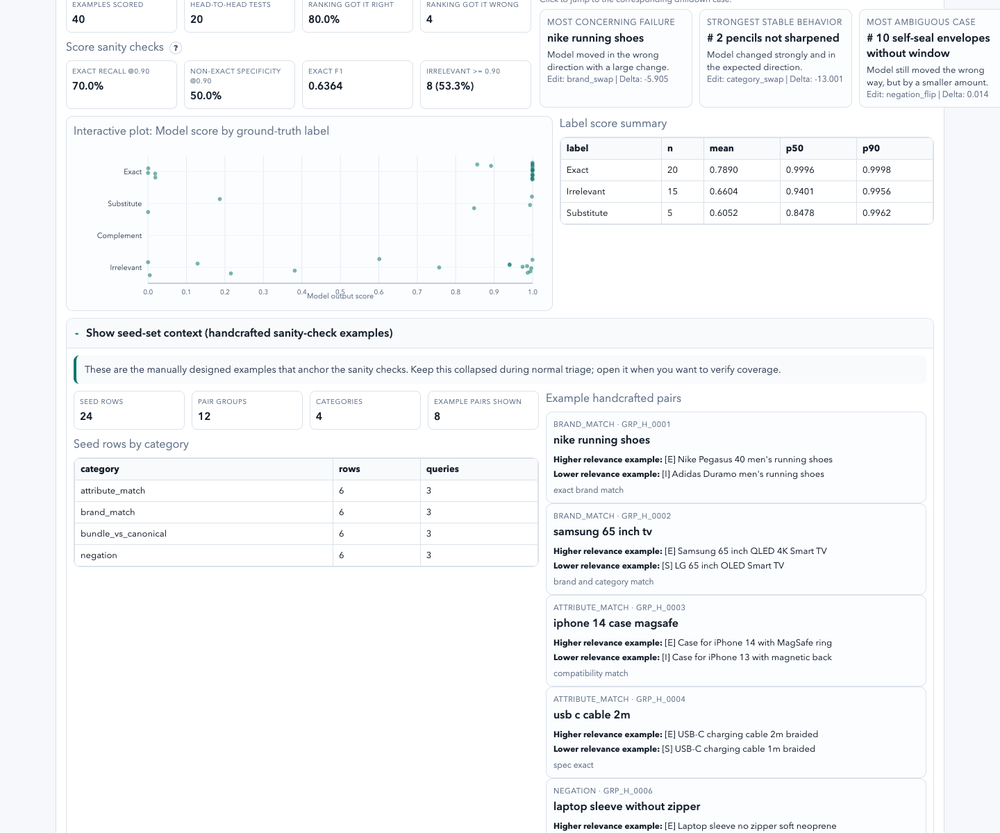
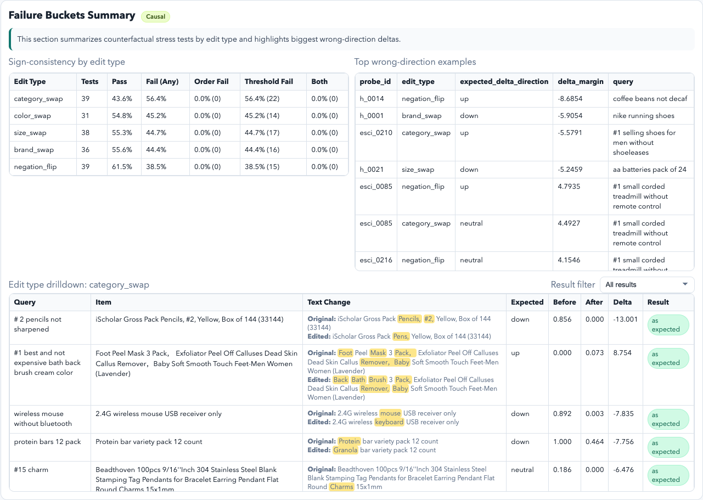
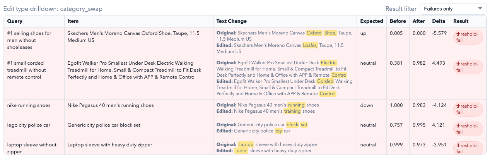

# BERT Relevance Debugger (Mechanistic-Interp Prototype)

This project is a beginner-friendly dashboard for understanding **why** a BERT cross-encoder ranks e-commerce items the way it does.

It is designed for questions like:
- "Is the model generally behaving well?"
- "Where does it fail?"
- "What changed when we edited brand/size/negation?"

Default model:
- `cross-encoder/ms-marco-MiniLM-L12-v2`

## What You Get
- A curated probe set (`ESCI + handcrafted edge cases`)
- Ranking and calibration checks
- Token attribution + attention summaries (observational evidence)
- Counterfactual edit tests (causal evidence)
- An interactive dashboard with beginner mode and drilldowns

## Quickstart
```bash
python3 -m venv .venv
source .venv/bin/activate
pip install -r requirements.txt

python src/curate_dataset.py
python src/generate_attributions_dataset.py
python src/generate_attention_dataset.py
# Optional: enable OpenAI-based expected-direction labels
# (if OPENAI_API_KEY is already exported, no extra flags are needed)
# python src/generate_counterfactual_dataset.py
# Optional: use OpenAI-based causal labeling + (default auto) OpenAI edits when key is available
# python src/generate_counterfactual_dataset.py --prompt-openai-api-key --openai-model gpt-5-mini
python src/generate_counterfactual_dataset.py
python src/build_dashboard.py
```

Open:
- `outputs/dashboard.html`

## Dashboard Walkthrough
1. Start at **Top 3 Examples** for quick intuition.
2. Use **Failure Buckets Summary** to see which edit types fail most (including order-vs-threshold failure breakdowns when causal v2 labels are present).
3. Click an edit type to drill into **individual query/item examples**, then use the drilldown **Result filter** to isolate failure cases.
4. Click an example row to jump to full detail.
5. In **Causal Tests**, compare before/after score changes and check whether reaction matched the expected ESCI label transition.
6. Use **Beginner Mode** for plain-language interpretation, or turn it off for full numeric detail.

## Screenshots
Overview:


Handcrafted seed set overview (balanced sanity-check examples):



Category/query/pair drilldown:


Observational diagnostics (token attribution + attention):


Causal summary (failure buckets + edit-type outcomes):



Causal drilldown (per-example score changes + text edits):



## Core Concepts (Plain English)
- **Observational evidence**: what the model seemed to focus on (attribution, attention).
- **Causal evidence**: what actually changed in score when we edited text.
- **ESCI-aware causal verdict**: whether the model's edited score/rank behavior matches the expected edited ESCI label (`E/S/C/I`) after the text change.

## Counterfactual Edit Types
Current deterministic edits:
- `brand_swap`
- `size_swap`
- `color_swap`
- `negation_flip`
- `category_swap`

Each row stores:
- original vs edited text,
- before/after model outputs,
- delta,
- optional expected edited ESCI label (OpenAI-labeled when API key is provided),
- derived label transition (for example `S->E`) and expected movement,
- threshold checks (`E > 0.9`, non-`E < 0.9`),
- ESCI-aware causal result (`pass`, `fail_order`, `fail_threshold`, `fail_both`, `marginal`, `ambiguous`),
- legacy expected-direction/sign-consistency fields (kept for backward compatibility).

By default, causal labels are **disabled** when no OpenAI API key is available. If a key is available in `OPENAI_API_KEY`, causal labeling is enabled automatically.
OpenAI edits now default to **auto** (use OpenAI if key is available, otherwise fallback to heuristics).

Generate with the defaults:
```bash
python src/generate_counterfactual_dataset.py
```
If you prefer hidden input for the key, use:

```bash
python src/generate_counterfactual_dataset.py --prompt-openai-api-key --openai-model gpt-5-mini
```

You can speed up OpenAI causal labeling (cache-miss-heavy runs) with bounded parallelism:

```bash
python src/generate_counterfactual_dataset.py --openai-model gpt-5-mini --openai-label-workers 4
```

### Optional: OpenAI counterfactual edit generation (cleaner edits)
Heuristic edits are fast but can create awkward strings in edge cases (for example negation flips).
When an OpenAI API key is available, `generate_counterfactual_dataset.py` now uses OpenAI edits by default (`--edit-generator auto`).
To force OpenAI-generated edits explicitly:

```bash
python src/generate_counterfactual_dataset.py --edit-generator openai
```

To force heuristic edits (even when a key is set):

```bash
python src/generate_counterfactual_dataset.py --edit-generator heuristic
```

OpenAI caches used by the causal pipeline:
- `outputs/openai_edit_cache.jsonl` (counterfactual edit generation)
- `outputs/openai_causal_label_cache.jsonl` (expected edited ESCI labels + derived direction labels)

Reruns are much faster once these caches are warm.

## Optional: OpenAI-Based Probe Tagging (for better category consistency)
By default, probe tags are heuristic. You can use an OpenAI classifier-style tagger (closed label set + cached results) during curation:

```bash
python src/curate_dataset.py --target-size 120 --tagger openai --prompt-openai-api-key --openai-model gpt-5-mini
```

Tagger outputs are cached to:
- `outputs/openai_tag_cache.jsonl`

### Heuristic lexicons (externalized)
The cheap heuristic tagger now loads vocab files from `data/heuristics/` when present:
- `brands.txt`
- `colors.txt`
- `spec_units.txt`
- `bundle_terms.txt`
- `negation_terms.txt`
- `stopwords.txt`

You can bootstrap a stronger `brands.txt` from Amazon Reviews'23 metadata:

```bash
python src/build_brand_lexicon_from_amazon_reviews23.py
```

This writes:
- `data/heuristics/brands.txt`
- `outputs/brand_lexicon_candidates.csv`

### Golden-set consistency check (recommended)
Use the provided template to create a small fixed evaluation set and track agreement over time:

```bash
python src/evaluate_tagger_golden.py \
  --golden-csv data/tagging_golden_set_template.csv \
  --prompt-openai-api-key \
  --openai-model gpt-5-mini \
  --out-csv outputs/tagger_golden_eval.csv
```

## Output Artifacts
Main files in `outputs/`:
- `scored_pairs.csv`
- `question_scorecard.csv`
- `failure_triage.csv`
- `absolute_scorecard.csv`
- `label_score_summary.csv`
- `absolute_violations.csv`
- `token_attributions.csv`
- `attention_summary.csv`
- `counterfactual_results.csv`
- `brief.md`
- `dashboard.html`

## Project Structure
- `src/inference.py`: scoring + relevance signal extraction
- `src/attribution.py`: token attribution (fast + IG modes)
- `src/attention.py`: attention summaries
- `src/causal.py`: counterfactual edit engine
- `src/reporting.py`: evaluation + artifact export
- `src/build_dashboard.py`: static dashboard generation
- `src/curate_dataset.py`: probe set build

## Tests
```bash
source .venv/bin/activate
python -m unittest discover -s tests -p 'test_*.py'
```

## Troubleshooting (Practical)
- **Curation looks stuck on ESCI streaming**: the Hugging Face stream can take a while before the first rows arrive; progress logs now print during warmup and collection.
- **Causal generation feels slow**: OpenAI labeling is network-bound and can be slow on the first run. Check `[CAUSAL]` progress logs and let caches warm (`openai_causal_label_cache.jsonl` / `openai_edit_cache.jsonl`).
- **OpenAI SSL certificate errors on macOS/Python**: install `certifi` in the venv (`pip install certifi`). The causal pipeline will automatically use `certifi` when available.
- **Python syntax errors using `python`**: make sure you are using the venv (`source .venv/bin/activate`) so `python` is Python 3, not system Python 2.

## Scope Note
This repo is a **toy but practical prototype** for relevance debugging. Counterfactual edits can be heuristic or OpenAI-generated (default auto when a key is present), but they are still a lightweight stress-testing mechanism, not a full production metadata parser.
