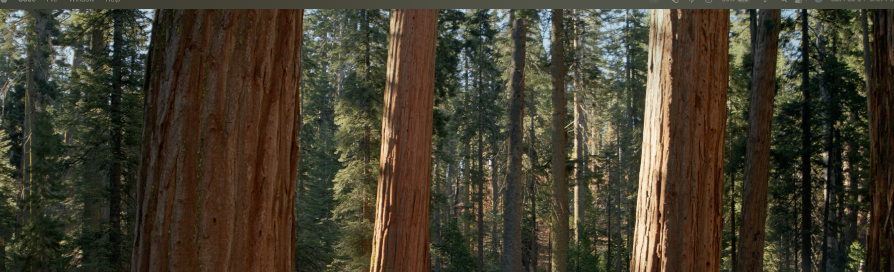
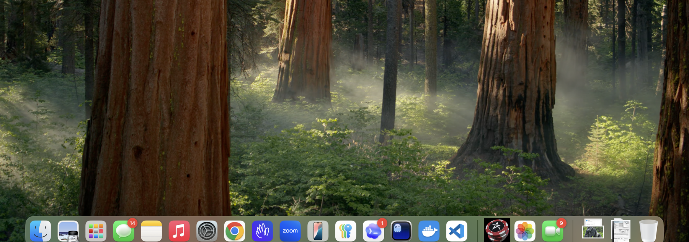

# BERT Cross-Encoder Mech-Interp Prototype (ESCI + Edge Cases)

This prototype explains **how** a cross-encoder relevance model behaves for e-commerce query-item pairs.

Model default:
- `cross-encoder/ms-marco-MiniLM-L12-v2`

Primary workflow:
1. Build a probe dataset (`ESCI-core + handcrafted edge cases`).
2. Score query-item pairs.
3. Run token attribution and attention summaries.
4. Produce question-driven scorecards and failure triage outputs.
5. Build a progressive-disclosure dashboard for interactive debugging.

## Project layout
- `src/inference.py`: model load + scoring
- `src/attribution.py`: gradient-based token attribution
- `src/attention.py`: layer/head attention summaries
- `src/probes.py`: ESCI load/tag/pair utilities
- `src/curate_dataset.py`: build `probe_set_v1.csv`
- `src/reporting.py`: directional checks + artifact export
- `src/generate_attributions_dataset.py`: per-probe attribution cache for dashboard drill-down
- `src/generate_attention_dataset.py`: per-probe attention cache for dashboard drill-down
- `src/build_dashboard.py`: static HTML dashboard generator
- `data/handcrafted_seed.csv`: guaranteed edge-case coverage
- `notebooks/cross_encoder_mech_interp.ipynb`: end-to-end runnable notebook

## Local quickstart (CPU is fine)
```bash
cd /Users/salvatoretornatore/Dev-Sandbox/BERT-Mech-Interp
python3 -m venv .venv
source .venv/bin/activate
pip install -r requirements.txt
python src/curate_dataset.py
jupyter notebook notebooks/cross_encoder_mech_interp.ipynb
```

## Outputs
The notebook writes artifacts to `outputs/`:
- `scored_pairs.csv`
- `question_scorecard.csv`
- `failure_triage.csv`
- `token_attributions.csv`
- `attention_summary.csv`
- `brief.md`

Generate a review dashboard (progressive drill-down):
```bash
cd /Users/salvatoretornatore/Dev-Sandbox/BERT-Mech-Interp
source .venv/bin/activate
python src/generate_attributions_dataset.py
python src/generate_attention_dataset.py
python src/build_dashboard.py
```
Then open:
- `outputs/dashboard.html`

Additional dashboard caches:
- `outputs/attributions_by_probe.csv`
- `outputs/attention_by_probe.csv`

## Dashboard navigation
The dashboard uses progressive disclosure:
1. `What Was Analyzed` (aggregate metrics + assumptions)
2. `Choose Category` (`brand_match`, `attribute_match`, `negation`, `bundle_vs_canonical`)
3. `Choose Query` (query-level ranking performance)
4. `Choose Query-Item Pair` (ground truth vs model score/result)
5. `Inspect Model Behavior` (token attribution + attention summary by layer)

Why query-level first:
- This is a ranking task, so the natural unit for diagnosis is query-level ordering, then candidate-level drill-down.

## Dashboard at a glance
Overview and top-level navigation:



Category -> query -> query-item drill-down:


Token attribution + attention diagnostics for the selected query-item pair:



## Ground truth and scoring semantics
Ground-truth mapping from ESCI:
- `Exact` = 3
- `Substitute` = 2
- `Complement` = 1
- `Irrelevant` = 0

Model output:
- Cross-encoder returns a logit; pipeline applies sigmoid to produce `score` in `[0,1]`.

Evaluation:
- Primary pass/fail is directional ranking within each `pair_group_id` (not direct score regression).

## ESCI label usage
The model is used as a **single-score ranker**. ESCI labels are used for ordered checks:
- `Exact > Substitute > Complement > Irrelevant`

## Optional Google Colab path
1. Open the notebook in Colab.
2. Runtime:
   - CPU for quick runs.
   - Optional T4/A100 GPU for larger probe sizes.
3. Install dependencies in first cell:
```python
!pip -q install torch transformers pandas numpy datasets scikit-learn
```
4. Run the same notebook steps and export CSV artifacts.

## Notes
- Attention is supporting evidence, not standalone explanation.
- `handcrafted_seed.csv` ensures negation and bundle cases are always represented.
